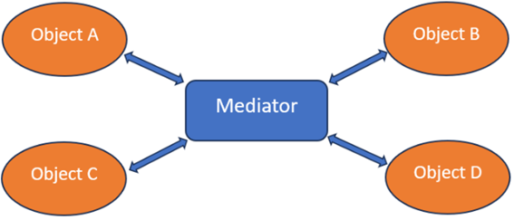
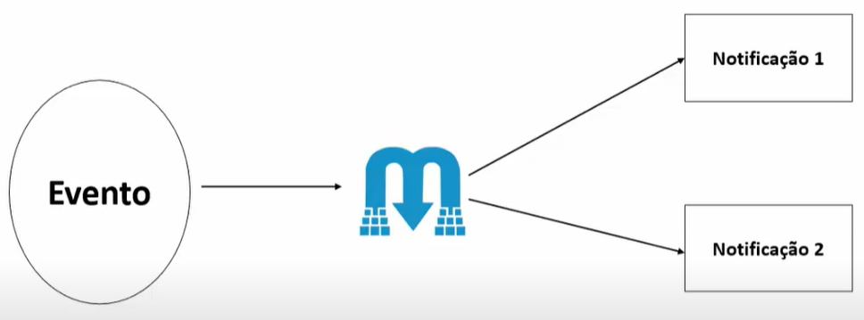

# MediatR e suas funcionalidades



A biblioteca [**MediatR**](https://github.com/jbogard/MediatR) é uma ferramenta para implementação do **Padrão Mediator**, onde esse padrão prevê um baixo acoplamento entre os objetos e o encapsulamento como esses objetos interajam eliminando a necessidade desse objeto se comunicarem.  

Um dos principais motivos do uso do **MediatR** é o desacoplamento de objeto. Também é possível utilizar o **MediatR** para facilitar implementar o **Padrão CQRS** entre outros.  

Quando fazemos uma alteração ou até mesmo uma consulta em nossa aplicação, normalmente mandamos um grupo de dados e esperamos outro grupo de dados. Normalmente quando esse grupo de entrada vai fazer apenas consultas sem executar nenhuma alteração de dados chamamos e tipo de input de **Request** e quando esse conjunto de dados de entrada irá fazer alguma alteração nos registros, seja ela: inclusão, alteração ou exclusão, chamamos esse conjunto de dados de **Command**.  

Normalmente quem faz essa manipulação, seja ela de **Request** ou **Command** é um objeto que chamamos de **Handler**.  

O **Handler** é uma classe que tem como objeto manipular as consulta e alterações solicitada pelo usuário e fazer a orquestração entre chamada, validações e retorno de outros objetos.   

Nessa classe ***não deve existir nenhuma regra de negócio***, apenas código necessário para orquestrar toda comunicação entre os vários objetos que fazem parte do fluxo invocado.  

No MediatR tanto uma Request quando um Command é uma intenção de solicitação e no MediatR isso é identificado com a interface IRequest. Já os Handlers são representados pela interface IRequestHandler.  

Tanto a interface **IRequest** quando a **IRequestHandler**, possuem variações que retornam e não retorna valores, sendo assim abaixo identificamos suas variações.

* `IRequest:` interface que representa um **Command ou Request** que não espera um retorna;
* `IRequest<TResponse>:` interface que representa um **Command ou Request** que espera um retorno do ***Tipo TResponse***, onde TResponse pode ser qualquer tipo objeto definido;
* `IRequestHandler<TRequest>:` interface que representa um **Handler** que deve ter uma entrada do tipo IRequest<TRequest> definido e que não retorna nenhum resultado, normalmente utilizando em método void;
* `IRequestHandler<TRequest, TResponse>:` interface que representa um **Handler** com entrada de **IRequest<TResponse>** e com um retorno esperado igual ao retorno do **IRequest<TResponse>** de entrada.

Abaixo temos um exemplo de uma Request/Response:
```csharp
public class Ping : IRequest<string> { }
```

Em seguida o manipulador:
```csharp
public class PingHandler : IRequestHandler<Ping, string>
{
    public Task<string> Handle(Ping request, CancellationToken cancellationToken)
    {
        return Task.FromResult("Pong");
    }
}
```

Caso a sua mensagem não exija resposta, implemente a **IRequest**:
```csharp
public class OneWay : IRequest { }
public class OneWayHandler : IRequestHandler<OneWay>
{
    public Task Handle(OneWay request, CancellationToken cancellationToken)
    {
        // do work
        return Task.CompletedTask;
    }
}
```
Para que o código acima funciona é preciso resolver as dependências do **MediatR**. Dado que a única forma que o MediatR tem para encontrar o Request, Response e Handler é através das classes informadas acima, precisamos registrar o MediatR e informar de onde ele vai buscar os objetos.

```csharp
var assembly = AppDomain.CurrentDomain.Load(“NomeDoProjeto”)
services.AddMediatR(cfg => cfg.RegisterServicesFromAssemblies(assembly));
```

Feito os procedimentos acima o que fica faltando saber é como enviamos um request para o **MediatR**.   

Para isso temos que injetar o objeto do **MediatR** no construtor do controlador que vai enviar a mensagem e depois temos que enviar o request através do comando send do **MediatR**.

Abaixo temos um exemplo de controlador simples que faz esse processo:
```csharp
using MediatR;
using MediatR.Application.Queries;
using Microsoft.AspNetCore.Mvc;

namespace DemoMediatR.WebApi.Controllers;

[Route("[controller]")]
[ApiController]
public class PersonController(IMediator mediator) : ControllerBase
{
    [HttpGet]
    public async Task<IActionResult> GetPersons()
    {
        var query = new GetPersonsQuery();
        var members = await mediator.Send(query);
        return Ok(members);
    }
}
```

Observe que estamos injetando a interface **IMediator** no construtor da classe em seguida estamos chamando no método GetPerson.

No método GetPersons estamos iniciados a classe do Tipo IRequest e estamos enviado no **send do MediatR**;

## PipelineBehavior do MediatR

O **MediatR** implementa um **Pipeline de Middleware** onde nos permitir interceptar algumas ações antes que elas ocorram, sendo assim é possível executar algum tipo de código antes ou até mesmo depois que determinado código seja executado.  

>Um exemplo de código que podemos colocar para esse cenário é uma validação.  

Todo código que recebemos do usuário por pratica deve ser validado e as vezes deixar essa responsabilidade a cargo do desenvolvedor pode ser meio arriscado, pois ele na correria do dia pode esquecer de executar essa validação. Para garantirmos que essa validação vai ser executada, podemos colocar na pipeline do MediatR uma chamada para validação do objeto.  

Para fazer isso iremos criar uma classe ValidationBehavior que implementa a interface: `IPipelineBehavior<TRequest, TResponse>`

Nessa classe ao implementar a interface acima, será criado o método Handler Conforme apresentado abaixo.

```csharp
public class ValidationBehavior<TRequest, TResponse>(IEnumerable<IValidator<TRequest>> validators) : IPipelineBehavior<TRequest, TResponse> where TRequest : IRequest<TResponse>
{
    public async Task<TResponse> Handle(TRequest request, RequestHandlerDelegate<TResponse> next, CancellationToken cancellationToken)
    {
        if (validators.Any())
        {
            var context = new ValidationContext<TRequest>(request);

            var validationResults = await Task.WhenAll(validators.Select(x => x.ValidateAsync(context, cancellationToken)));

            var failures = validationResults.SelectMany(r => r.Errors).Where(f => f != null).ToList();

            if (failures.Count != 0)
                throw new ValidationException(failures);
        }

        return await next();
    }
}

```

### Vamos analisar a assinatura do método Handler.  

Se observou bem, temos um parâmetro chamado next que é do tipo **RequestHandlerDelegate**. Esse parâmetro é de fundamental importância em nosso método, ele que é responsável por continuar ou aborta a navegação entres os demais **Middleware do Pipeline.**  

Ao chamar esse método estamos dizendo para o Pipeline seguir para o próximo **Middleware** ou invocar o se **Handler**, enviar uma **Exception** estamos dizendo para o Pipeline que a operação será abortada e caso o **next** não seja chamado e o **Exception** não seja lançada, nenhuma operação irá ocorrer, pois o Pipeline não irá saber qual o próximo passo a seguir.  

**Considerando a criticidade explicada acima, sempre temos que ter em mente o seguinte: ou chamamos o next no final do método ou devemos lançar uma Exception.**  

> Sabendo que o parâmetro next define que o fluxo deve continuar temos uma analise importante aqui: se colocar uma código antes de chamar o next iremos ter esse código antes de executar o nosso Handler e se colocar o código depois do next teremos um código executado depois do Handler.  

```csharp
public class LoggingBehavior<TRequest, TResponse> : IPipelineBehavior<TRequest, TResponse> where TRequest : IRequest<TResponse>
{
    private readonly ILogger<LoggingBehavior<TRequest, TResponse>> _logger;

    public LoggingBehavior(ILogger<LoggingBehavior<TRequest, TResponse>> logger)
    {
        this._logger = logger ?? throw new ArgumentException(nameof(ILogger));
    }

    public async Task<TResponse> Handle(TRequest request, RequestHandlerDelegate<TResponse> next, CancellationToken cancellationToken)
    {
        ArgumentNullException.ThrowIfNull(request);
        
        //Executa comando antes do Handler
        _logger.LogWarning("----- Handling command {CommandName} ({@Command})", request.GetGenericTypeName(), request);

        var response = await next();

        //Executa comando depois do Handler
        _logger.LogWarning("----- Command {CommandName} handled - response: {@Response}", request.GetGenericTypeName(), response);

        return response;
    }
}
```

> É importante lembrar que ao criar nossa classe de **PipelineBehavior** é necessário fazer o registro de todos e eles no nosso container de Injeção de dependência e a **ordem que eles são listados que serão acionados**. 

```csharp
public static class MediatRHandlerExtension
{
    public static IServiceCollection AddMediatRHandler(this IServiceCollection services)
    {
        const string applicationAssemblyName = "Ordering.Api";
        var assembly = AppDomain.CurrentDomain.Load(applicationAssemblyName);

        AssemblyScanner
            .FindValidatorsInAssembly(assembly)
            .ForEach(result => services.AddScoped(result.InterfaceType, result.ValidatorType));

        services.AddMediatR(configuration =>
        {
            configuration.AddBehavior(typeof(IPipelineBehavior<,>), typeof(LoggingBehavior<,>));
            configuration.AddBehavior(typeof(IPipelineBehavior<,>), typeof(ValidationBehavior<,>));

            configuration.RegisterServicesFromAssemblies(assembly);
        });

        return services;
    }
}
```

## Notificação de Eventos


O recurso de Notificação de eventos e formar de encapsular notificações de eventos ou mensagens que podem ser transmitidas entre os vários módulos do sistema que irão ocorrer sem acoplamento de seus componentes.  

Esse recurso utiliza a interface **INotification** fornecida pela biblioteca **MediatR** que representa uma notificação ou mensagem a ser transmitida através do mediador nesse caso nossa biblioteca Mediator que pode conter informações relevantes sobre um evento que ocorreu no sistema.  

Essa funcionalidade é muito útil para notificações de eventos entre domínios ou eventos que ocorram simultaneamente em determinada faze do domínio.  

Imagine a seguinte situação: um aluno quando tira nota abaixo de 7 deve ser notificado aos pais por meio de SMS e e-mail que o aluno não foi muito bem nas notas. Concorda que esse evento não tem muito a ver com o contexto do negócio de apuração de nota? Neste caso podemos externalizar esse evento para uma notificação, e todos os métodos que assinar esse tipo de evento será invocado automaticamente.  

### Como usar essa funcionalidade de Notificação

Para usar essa funcionalidade é preciso criar uma classe que implementa a interface **INotification**, depois iremos criar um **Handler** que implementa a interface `INotificationHandler<TNotification>` em seguida temos que publicar o evento chamando o método **Publish** criando uma nova instancia da classe de notificação.

### Criando Evento e Handler a ser Notificado:

```csharp
public class PersonCreatedNotificationEvent(Person person) : INotification
{
    public Person Person { get; } = person;
}

public class PersonCreatedSMSEventHandler(ILogger<PersonCreatedEmailEventHandler> logger) : INotificationHandler<PersonCreatedNotificationEvent>
{
    public Task Handle(PersonCreatedNotificationEvent notification, CancellationToken cancellationToken)
    {
        //envia confirmação SMS
        logger.LogInformation($"Confirmation sms sent for : {notification.Person.FirstName}");

        //logica para enviar SMS
        return Task.CompletedTask;
    }
}
public class PersonCreatedEmailEventHandler(ILogger<PersonCreatedEmailEventHandler> logger) : INotificationHandler<PersonCreatedNotificationEvent>
{
    Task INotificationHandler<PersonCreatedNotificationEvent>.Handle(PersonCreatedNotificationEvent notification, CancellationToken cancellationToken)
    {
        // Enviar confirmação por e-mail
        logger.LogInformation($"Confirmation email sent for : {notification.Person.LastName}");

        //lógica para enviar email   
        return Task.CompletedTask;
    }
}
```

### Publicar evento

Observe no código abaixo que estamos instancia o objeto **PersonCreateNotificationEvent** e fazendo a publicação dele.  

```csharp
using DemoMediatR.Application.Commands;
using DemoMediatR.Application.Events;
using DemoMediatR.Domain.Abstractions;
using DemoMediatR.Domain.Entities;

using MediatR;

namespace DemoMediatR.Application.Handlers;

public class CreatePersonsCommandHandler(IMediator mediator, IUnitOfWork unitOfWork) : IRequestHandler<CreatePersonCommand, Person>
{
    public async Task<Person> Handle(CreatePersonCommand request, CancellationToken cancellationToken)
    {
        var newMember = new Person(request.FirstName, request.LastName, request.Gender, request.Email, request.IsActive ?? false);

        await unitOfWork.PersonRepository.AddPerson(newMember);
        await unitOfWork.CommitAsync();

        await mediator.Publish(new PersonCreatedNotificationEvent(newMember), cancellationToken);

        return newMember;
    }
}
```

Feito isso todos os EventHandlers que estiverem assinando esse Evento serão acionados automaticamente. Nesse caso o EventHandler:

* PersonCreatedEmailEventHandler
* PersonCreatedSMSEventHandler

### Resumo 

Até aqui mostramos como o **MediaR** pode nos auxiliar na implementação do **Padrão Mediador** e como o MediatR funciona.  

Mostra como se faz para enviar uma mensagem para um Handler e como declarar um **Request e Command**.  

Apresentamos como funciona o **PipelineBehavior** e como funciona e configuração e para finalizar apresentamos o mecanismo de publicação de **Notificação**.  

Agora que tudo está apresentando vamos deixar uma lista ordenada de como ocorre o fluxo dentro do MediatR.  

1.	Criar um Request
1.	Criar um Handler de Request
1.	Criar Notificação
1.	Criar Handler de Notificação
1.	Enviar uma Mensagem para Handler
1.	Dispara o Behavior se existir antes
1.	Aciona Handler
1.	Publicação Notificação
1.	Chama todos os Handler que estão assinando a Notificação

### Referencia

[**MediatR**](https://github.com/jbogard/MediatR)
[Padrão Mediador]()
